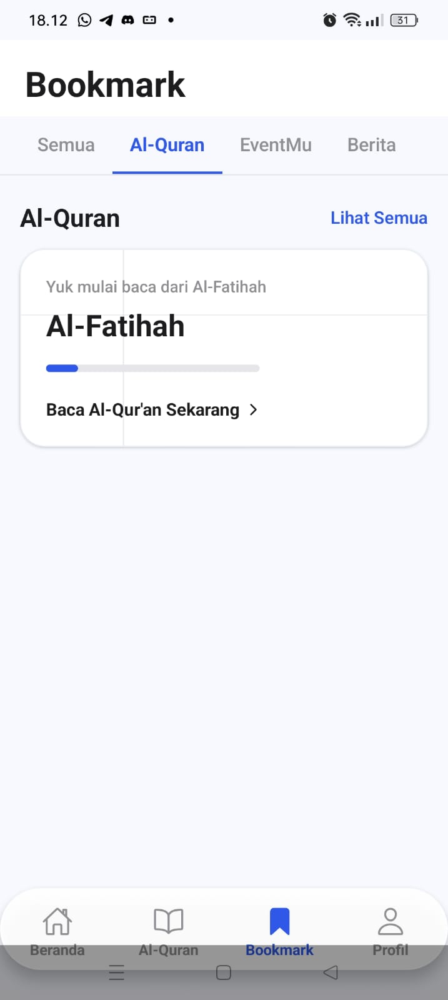
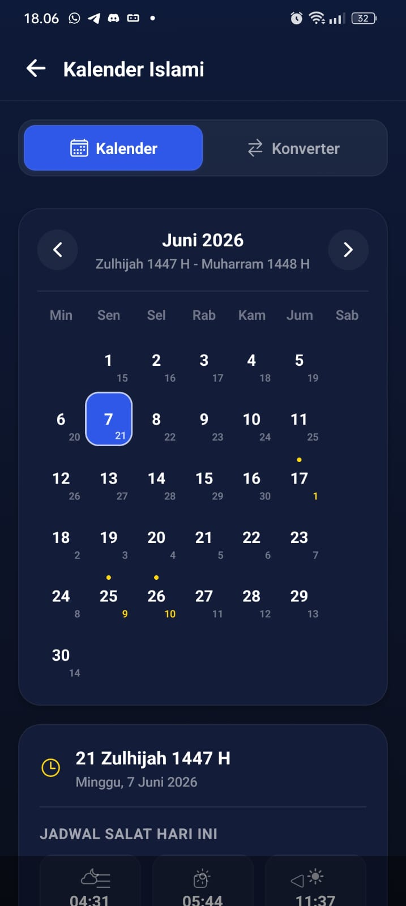
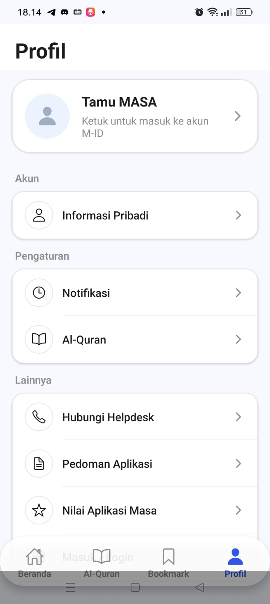
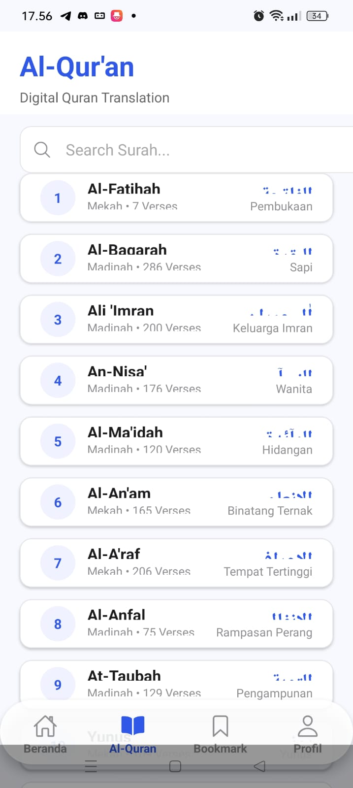
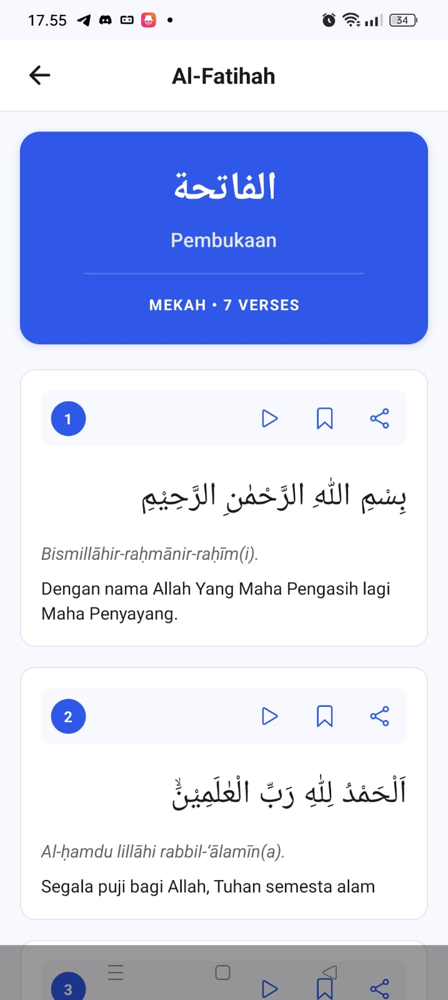
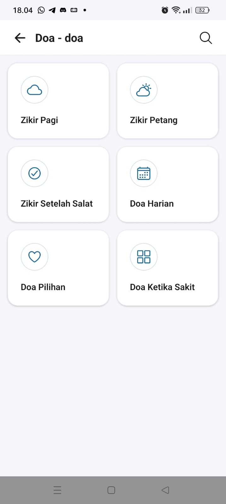
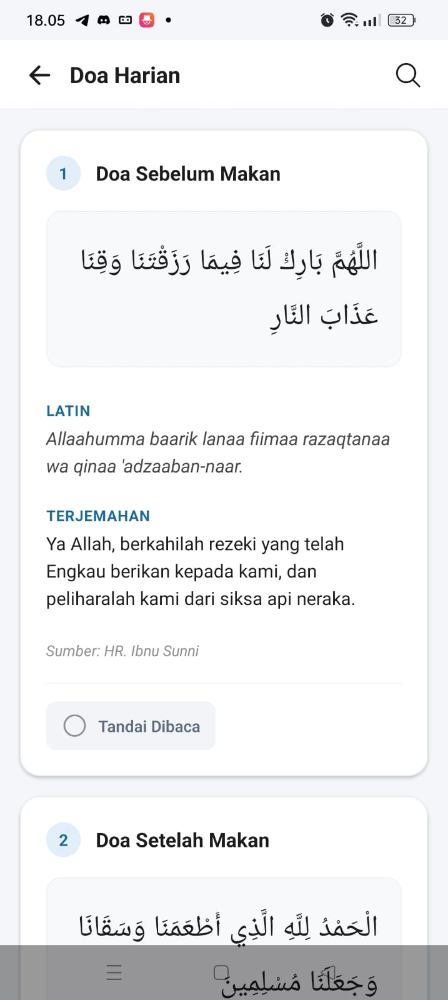
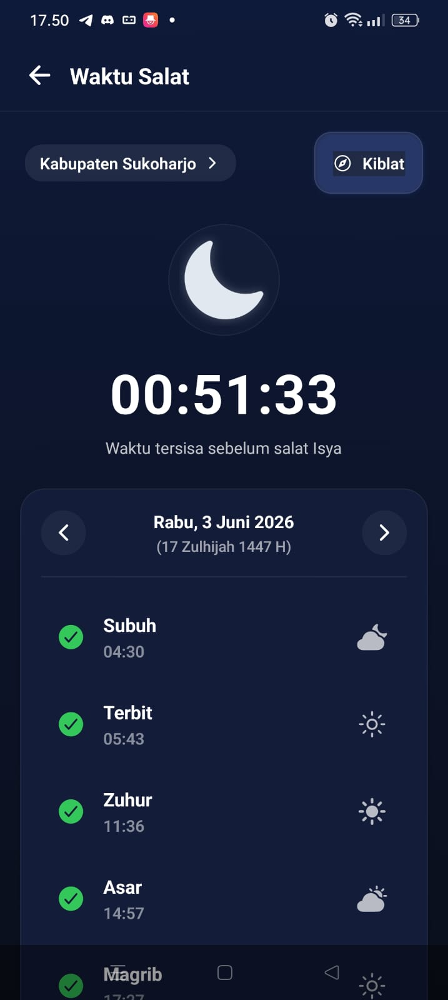

# MASA App Clone - Dokumentasi Project (README)


Aplikasi mobile **MASA App Clone** dirancang menggunakan **Expo** dan **React Native** untuk mereplikasi fitur utama dari aplikasi _MASA_ (Muslim Lifestyle Application) yang dikembangkan oleh Muhammadiyah Software Labs. 
Aplikasi ini mencakup berbagai utilitas ibadah harian seperti jadwal salat, kompas kiblat, Al-Qur'an digital, kumpulan doa harian, kalender Hijriah beserta konverternya, dan manajemen akun pengguna.


---


## 👥 Anggota Kelompok & ID Mahasiswa


Aplikasi ini dikembangkan oleh kelompok mahasiswa **Universitas Muhammadiyah Surakarta (UMS)**:


| Nama                         | NIM / Student ID | Peran / Kontribusi                 |
| :--------------------------- | :--------------- | :--------------------------------- |
| **Onic Agustino**            | `L200234275`     | Homepage, Prayer Feature, Bookmark |
| **Mahardika Fatwa Ramadhan** | `L200248067`     | Quran, Surah Details, and Documentation            |
| **Guruh Widisaputra**        | `L200244058`     | EAS Build + Project Configuration  |
| **Affan Ilham Arsyila**      | `L200234024`     | Authentication, Profile, Audio Playback, Bookmarks, Salat Hook, Documentation |


_(Silakan lengkapi tabel di atas sesuai dengan pembagian tugas kelompok Anda)_


---


## 📌 Project Overview


Aplikasi ini adalah replika fungsional dan estetis dari MASA App dengan pendekatan desain premium modern (clean UI, glassmorphism tabs, and custom layouting). Aplikasi dibangun menggunakan **Expo SDK 54** dan **Expo 
Router** untuk manajemen navigasi file-based yang mulus.


Aplikasi ini mendukung mode **Online Autentikasi** menggunakan **Clerk** maupun **Mock Keyless Mode** (lokal offline fallback) agar mempermudah pengujian oleh tim penguji tanpa keharusan setup Clerk API key terlebih 
dahulu.


---


## 📸 Screenshots Aplikasi


Berikut adalah tampilan antarmuka dari beberapa halaman utama aplikasi MASA App Clone:


|                 Bookmark                 |                 Kalender                 |                          Konverter Kalender                          |                Profil                 |
| :--------------------------------------: | :--------------------------------------: | :------------------------------------------------------------------: | :-----------------------------------: |
|  |  |  |  |


|                 Al-Qur'an                        |               Detail Al-Qur'an           |                          Kompas Kiblat                               |                interface doa          |
| :----------------------------------------------: | :--------------------------------------: | :------------------------------------------------------------------: | :-----------------------------------: |
|  |  |  |  |


|                 Detail Doa                 |                 Jadwal Shalat                 |
| :--------------------------------------: | :---------------------------------------------: | 
|  |        |


---


## ✨ Fitur-Fitur yang Diimplementasikan


Berikut adalah fitur utama yang berhasil diintegrasikan di dalam aplikasi:


1. **Dashboard Utama (Beranda)**
   - Greeting dinamis menyesuaikan status login pengguna (_"Assalamualaikum [Nama]"_ atau _"Assalamualaikum Tamu"_).
   - Widget Salat Premium dengan countdown real-time ke jadwal salat berikutnya serta ilustrasi grafis lintasan matahari & awan.
   - Pilihan lokasi jadwal salat yang dapat disesuaikan secara manual maupun otomatis menggunakan GPS.
   - Widget Kalender Islam & Masehi yang dapat ditoggle secara instan.
   - Kotak "Pesan Hari Ini" (Daily Ayat Quote) menampilkan teks Arab, transliterasi, dan terjemahan Indonesia (QS. Al-Insyirah: 6).
   - Shortcut akses cepat ke 4 menu utama: Salat, Al-Quran, Doa, dan Kalender.


2. **Jadwal Salat & Waktu Salat Detail (`app/salat.tsx`)**
   - Menampilkan 6 waktu salat: Subuh, Terbit, Zuhur, Asar, Magrib, dan Isya.
   - Perhitungan jadwal salat dinamis berdasarkan tanggal yang dipilih (menggunakan formula sinusoidal variance untuk mensimulasikan pergeseran waktu secara alami).
   - Penandaan otomatis untuk waktu salat yang sudah terlewati (green checkmark indicator).
   - Integrasi shortcut ke halaman pencarian arah kiblat.


3. **Kompas Arah Kiblat (`app/kiblat.tsx`)**
   - Target sudut Kiblat diatur khusus untuk wilayah Indonesia (~294° derajat searah jarum jam dari utara).
   - **Sensor Otomatis**: Menggunakan sensor `Magnetometer` (`expo-sensors`) untuk melacak arah hadap ponsel secara real-time.
   - **Mode Simulasi Manual**: Bila sensor magnetometer tidak tersedia (misal di Emulator/Simulator), aplikasi menyediakan fallback interaktif menggunakan gesture geser/drag (`PanResponder`) pada piringan kompas untuk 
meluruskan jarum ke arah Ka'bah.
   - Visualisasi pin Ka'bah yang menyala hijau saat piringan kompas berhasil diarahkan dengan presisi (toleransi kesalahan ±6° derajat).


4. **Al-Qur'an Digital (`app/(tabs)/quran.tsx` & `app/surah/[id].tsx`)**
   - **Daftar Surah**: Memuat seluruh 114 surah lengkap dari API eksternal secara asinkron dengan fitur pencarian filter instan (berdasarkan nama latin surah atau arti surah).
   - **Halaman Detail Surah**: Menampilkan seluruh ayat surah dengan visualisasi tipografi Arab yang nyaman dibaca, transliterasi Latin, serta terjemahan bahasa Indonesia per ayat.


5. **Kumpulan Doa Harian (`app/doa/`)**
   - Halaman indeks berisi grid kategori doa (seperti doa ibadah, doa aktivitas harian, doa keluarga, dll.) dilengkapi search bar global untuk mencari doa tertentu.
   - Modal popup detail doa yang menampilkan teks Arab tulisan besar, transliterasi Latin, terjemahan Indonesia, keutamaan doa (Fadhilah), serta sumber referensi periwayatan doa.


6. **Kalender Islami & Konverter Tanggal (`app/kalender.tsx`)**
   - Tampilan grid kalender bulanan yang memetakan tanggal Masehi sekaligus tanggal Hijriah di dalam sel tanggal yang sama.
   - Penandaan otomatis untuk hari-hari besar Islam (Idul Fitri, Idul Adha, Tahun Baru Hijriah, Maulid Nabi, dll.) dengan dot indikator merah.
   - **Konverter Tanggal Dua Arah**: Halaman utilitas untuk mengonversi tanggal Masehi ke Hijriah dan sebaliknya secara matematis menggunakan perhitungan tabulasi algoritma Julian Day.
   - Detail list hari besar Islam dalam tahun tersebut lengkap dengan konversi tanggal masehinya.


7. **Sistem Bookmark & Progress Baca (`app/(tabs)/bookmark.tsx`)**
   - Pengelompokan kategori bookmark (Semua, Al-Quran, EventMu, Berita).
   - Kartu progress membaca Al-Qur'an terakhir (menampilkan persentase progress membaca surah).
   - Ilustrasi empty state yang interaktif untuk bookmark kosong.


8. **Profil Pengguna & Pusat Bantuan (`app/(tabs)/profile.tsx`)**
   - Integrasi data nama lengkap dan email pengguna yang aktif login melalui Clerk.
   - Akses cepat menuju menu Informasi Pribadi, Pengaturan Notifikasi, Bantuan Helpdesk via email, Pedoman Aplikasi, serta tombol Log-Out.


---


## 🔒 Clerk Authentication & User Management Flow


Aplikasi ini menggunakan **Clerk Expo** sebagai penyedia layanan autentikasi utama. Struktur flow login dibungkus di dalam provider kustom (`AppAuthProvider` di `@/hooks/use-app-auth`) untuk mengimplementasikan dual-mode:


```
                  ┌──────────────────────────────┐
                  │   Mulai Aplikasi (Layout)    │
                  └──────────────┬───────────────┘
                                 │
                     Apakah ada Clerk Key?
                                 │
                   ┌─────────────┴─────────────┐
                  Ya                          Tidak
                   │                           │
        ┌──────────┴──────────┐     ┌──────────┴──────────┐
        │   Mode Clerk Aktif  │     │  Mode Simulasi/Mock │
        └──────────┬──────────┘     └──────────┬──────────┘
                   │                           │
        • E-mail & Password Auth    • Simpan status login
        • Google OAuth (WebBrowser)   di AsyncStorage.
        • Email OTP (6 digit)       • Autentikasi instan
        • Background OTP bypass*      untuk testing lokal.
                   │                           │
                   └─────────────┬─────────────┘
                                 ▼
                     ┌───────────────────────┐
                     │ Beranda / Home Screen │
                     └───────────────────────┘
```


### Rincian Flow Autentikasi:


1. **Pendaftaran Akun (Sign Up)**:
   - Pengguna memasukkan Email, Username, Nomor Telepon, dan Password.
   - **Penanganan Nomor Telepon**: Terdapat validasi E.164. Karena Clerk test tier terkadang membatasi kode negara Indonesia (+62), sistem secara otomatis memetakan nomor telepon Indonesia ke nomor simulasi test-tier 
Amerika Serikat (`+120255501XX`) secara aman di background.
   - **Verifikasi OTP**: Kode verifikasi OTP dikirimkan ke email pengguna. Pengguna memasukkan kode 6 digit untuk mengaktifkan akun. Jika pendaftaran memerlukan OTP telepon, sistem secara otomatis memasukkan bypass OTP 
kode default (`424242`) untuk nomor simulasi di background agar proses verifikasi tidak terhambat.
2. **Masuk Akun (Sign In)**:
   - Login konvensional menggunakan email & password.
   - **Google OAuth**: Mendukung login satu klik menggunakan akun Google. Memanfaatkan `expo-web-browser` dan `expo-linking` untuk menghandle siklus redirect autentikasi secara native.
3. **Mock Mode (Fallback)**:
   - Apabila Clerk Publishable Key (`EXPO_PUBLIC_CLERK_PUBLISHABLE_KEY`) tidak dideklarasikan di file `.env`, aplikasi akan mengaktifkan _Mock Mode_.
   - Semua fungsi sign-in, sign-up, dan sign-out disimulasikan menggunakan penyimpanan lokal `AsyncStorage` dengan key `mock_signed_in`.
   - Mengizinkan tester membuka seluruh halaman terproteksi dengan kredensial dummy apapun.


---


## 🔌 API Eksternal yang Digunakan


Aplikasi ini memanfaatkan beberapa API dan pustaka eksternal untuk menyajikan data secara real-time:


1. **API Al-Qur'an Digital**:
   - Sumber: `https://equran.id`
   - Endpoint List Surah: `https://equran.id/api/v2/surat` (Method: `GET`)
   - Endpoint Detail Surah & Ayat: `https://equran.id/api/v2/surat/${id}` (Method: `GET`)
2. **Reverse Geocoding (Location API)**:
   - Menggunakan modul `expo-location`.
   - Mengonversi koordinat lintang/bujur (Latitude/Longitude) perangkat dari sensor GPS menjadi nama wilayah/kota di Indonesia menggunakan API geocoding bawaan Expo secara aman.
3. **Sensor Magnetometer**:
   - Menggunakan modul `expo-sensors` (`Magnetometer`) untuk melacak arah medan magnet bumi guna menentukan arah utara kompas secara real-time.


---


## 🚀 Cara Menjalankan Aplikasi Secara Lokal


Ikuti langkah-langkah di bawah ini untuk menjalankan project di komputer Anda:


### 1. Prasyarat


Pastikan komputer Anda sudah terinstal:


- **Node.js** (versi 18 atau yang lebih baru)
- **Git**
- Aplikasi **Expo Go** pada ponsel fisik Anda (tersedia di Play Store & App Store), atau Emulator Android Studio / Xcode Simulator yang sudah terkonfigurasi.


### 2. Instalasi Dependensi


Clone repository ini, masuk ke direktori project, lalu jalankan instalasi package via NPM:


```bash
npm install
```


### 3. Konfigurasi Environment Variables


1. Copy file `.env.example` menjadi `.env` di root direktori project:
   ```bash
   cp .env.example .env
   ```
2. Buka file `.env` dan masukkan API Key Clerk Anda jika ingin menguji fitur autentikasi asli:
   ```env
   EXPO_PUBLIC_CLERK_PUBLISHABLE_KEY=pk_test_your_clerk_publishable_key
   ```
   _(Bila dibiarkan default/kosong, aplikasi secara otomatis berjalan menggunakan Mock Mode)_


### 4. Menjalankan Development Server


Mulai server Expo development dengan menjalankan perintah:


```bash
npm run start
```


Atau menggunakan CLI Expo langsung:


```bash
npx expo start
```


### 5. Membuka Aplikasi


Setelah terminal menampilkan QR Code:


- **Ponsel Android**: Buka aplikasi **Expo Go**, lalu pilih menu **Scan QR Code**.
- **Ponsel iOS**: Buka aplikasi kamera bawaan iOS, arahkan ke QR Code di terminal, lalu klik tautan Expo Go yang muncul.
- **Emulator/Simulator**: Tekan tombol `a` di terminal untuk membuka Android Emulator, atau tekan `i` untuk iOS Simulator.


---


## 📦 Cara Build Aplikasi dengan EAS (Expo Application Services)


EAS Build adalah layanan cloud dari Expo untuk mengompilasi kode React Native menjadi file biner standalone (APK/AAB untuk Android dan IPA untuk iOS).


### 1. Instalasi EAS CLI secara Global


Pasang utilitas EAS CLI pada komputer Anda:


```bash
npm install -g eas-cli
```


### 2. Login ke Akun Expo


Masuk menggunakan akun Expo Anda (daftarkan diri terlebih dahulu di [expo.dev](https://expo.dev/) jika belum punya):


```bash
eas login
```


### 3. Konfigurasi Project untuk EAS


Inisialisasi EAS pada project Anda (ini akan meminta Anda memilih akun/organisasi serta membuat file konfigurasi `eas.json` di root folder):


```bash
eas build:configure
```


### 4. Contoh Konfigurasi `eas.json` yang Direkomendasikan


Pastikan isi file `eas.json` Anda mencakup profil _preview_ (untuk menghasilkan APK) dan _production_:


```json
{
  "cli": {
    "version": ">= 10.0.0"
  },
  "build": {
    "development": {
      "developmentClient": true,
      "distribution": "internal"
    },
    "preview": {
      "distribution": "internal",
      "android": {
        "buildType": "apk"
      }
    },
    "production": {}
  },
  "submit": {
    "production": {}
  }
}
```


### 5. Menjalankan Build Standalone


Jalankan kompilasi pada server cloud Expo dengan perintah berikut:


- **Build Android APK (Preview/Installable)**:
  ```bash
  eas build --platform android --profile preview
  ```
- **Build iOS (Preview/Simulator)**:
  ```bash
  eas build --platform ios --profile preview
  ```
- **Build Semua Platform Sekaligus (Production)**:
  ```bash
  eas build --platform all --profile production
  ```


_Catatan: Proses kompilasi cloud biasanya membutuhkan waktu 5-15 menit tergantung antrean server Expo._


---


## 📲 Cara Mengakses & Menginstal Standalone Build


Setelah proses EAS Build selesai, Anda dapat mengunduh dan memasang aplikasi tersebut di ponsel dengan metode berikut:


### 1. Unduh Melalui Link Dashboard Expo


1. Di akhir proses EAS Build di terminal, Anda akan diberikan sebuah tautan web (misalnya: `https://expo.dev/artifacts/eas/...`).
2. Buka link tersebut di browser komputer atau ponsel Anda.
3. Klik tombol **Download** untuk mengunduh file biner:
   - **Android**: File `.apk` (Preview) atau `.aab` (Production).
   - **iOS**: Tautan instalasi _Ad-Hoc / TestFlight_.


### 2. Instalasi Melalui QR Code (Sangat Direkomendasikan)


1. Setelah build selesai, terminal atau halaman dashboard Expo akan memunculkan sebuah **QR Code instalasi**.
2. Scan QR Code tersebut menggunakan kamera ponsel Anda.
3. Anda akan diarahkan ke halaman web Expo untuk mengunduh aplikasi secara langsung ke ponsel.
4. **Android (Khusus APK)**:
   - Setelah file `.apk` selesai diunduh, buka file tersebut.
   - Jika muncul peringatan keamanan _"Blocked by Play Protect"_ atau _"Install from Unknown Sources"_, pilih **Install Anyway** / Izinkan instalasi dari sumber tidak dikenal.
   - Aplikasi kini terpasang secara permanen di ponsel Anda dan dapat dijalankan secara mandiri tanpa terhubung ke komputer/development server.
